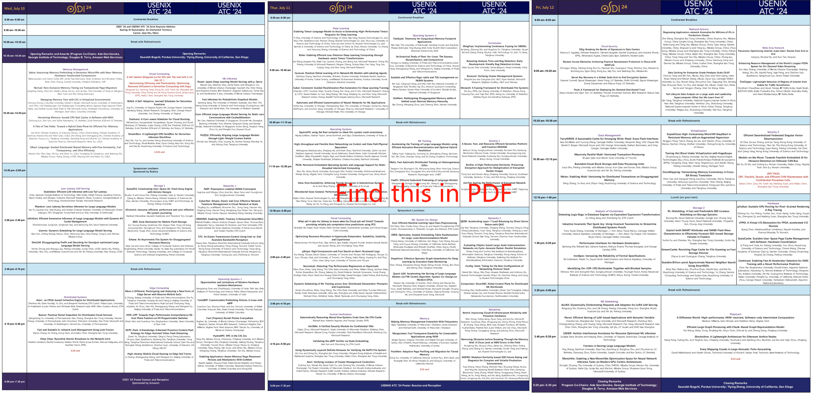

# Confidential Procedure Calls

## Abstract

Confidential virtual machines (CVMs), while providing strong data privacy for cloud tenants, pose significant challenges to VM maintenance like live migration and snapshotting. Traditional host-based maintenance, while applicable to conventional VMs, is infeasible for CVMs due to the lack of trust in the host and the prevention of mandated intrusive access from the host. State-of-the-art approaches depend on non-trivial modifications to hardware and firmware and thus lead to notable compromises in security and/or performance. Furthermore, such approaches lack flexibility for upgrades and cross-platform compatibility, hindering the popularity of CVMs on the cloud.

In this paper, we introduce Confidential Procedure Calls (CPCs), a flexible approach to the efficient and secure execution of CVM maintenance modules from within the guest. We have implemented prototypes on two leading CVM platforms. Our prototype on AMD SEV showcases the high performance of CPCs, with 3× (resource reclamation) or even 138× (live migration) faster than existing approaches. Our prototype on ARM CCA further confirms CPCs' outstanding security and flexibility.

## Poster

<picture>
    
</picture>

You can also download the [PDF](./CPC-Poster-with-Timeline.pdf) file. I also add a paper timeline for OSDI/ATC'24.



## Conference

This research has been accepted by [USENIX ATC'24](https://www.usenix.org/conference/atc24) and [ChinaSys'24](http://www.cnsys24-spring.org.cn/).

You can find the talk in Chinese at [CPC-ChinaSys'24](https://1300723556.vod2.myqcloud.com/f30c0e09vodsh1300723556/649494c61253642698744227405/XlFUvAWb1AgA.mp4).

The talk in English will be available soon at [CPC-ATC'24](https://www.usenix.org/conference/atc24/presentation/chen-jiahao).

## Contact Us

Email: chenjiahaosys@gmail.com

## Cite

If you find this work helpful for your publication, please cite CPC's ATC'24 paper:

```
Not yet publicly available, see details at https://www.usenix.org/conference/atc24/technical-sessions.
```
